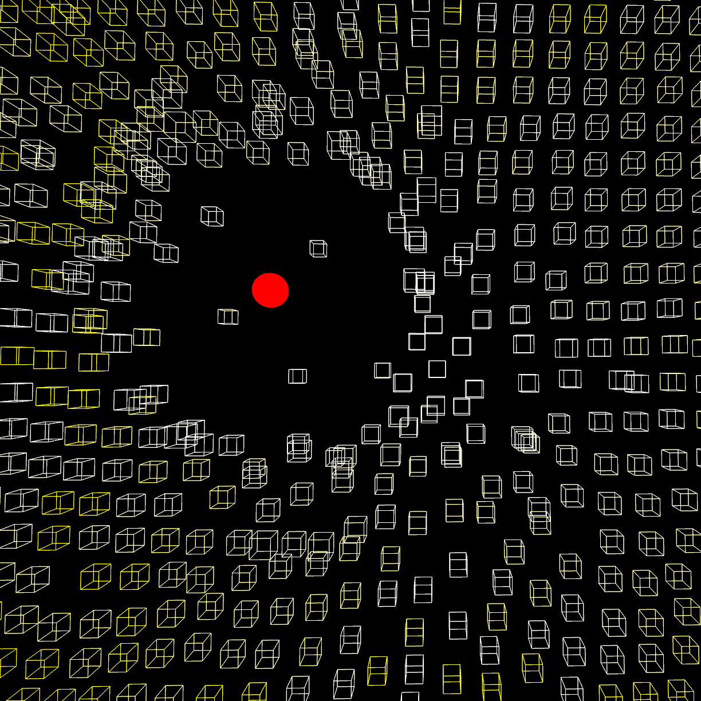

# Three.js + Rapier Physics + Creative Coding = 😎

A fun physical simulation using Three.js and Rapier. Watch as code transforms into flowing, bouncing, and colliding shapes—driven by motion and energy. Perfect for anyone exploring Three.js, generative art and similations.

✨ What You’ll Learn:

Integrating Rapier for physics-based interactions

Building a custom mouse-driven controller to move and smack aroung a grid of boxes in real-time

Bonus: how to debug your physics simulation with Points!

Another fun and surprisingly powerful effect to add to your toolkit.

## Dependencies
- [Three.js](https://threejs.org/) (WebGPU Renderer, Orbit Controls)
- [Rapier Physics](https://rapier.rs/)

## Development
Modify `index.js` to experiment with different Three.js objects, materials, or effects.

## License
This project is licensed under the MIT License. Feel free to modify and distribute.

